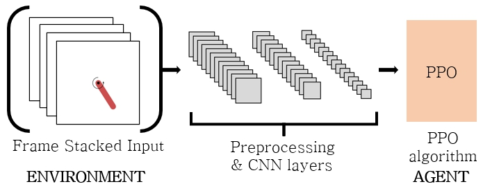
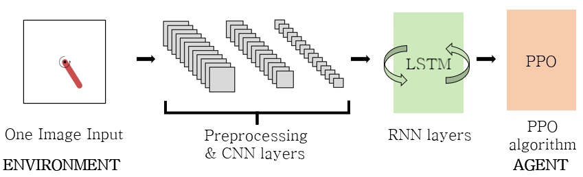
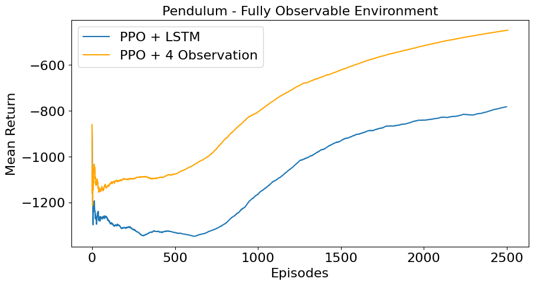
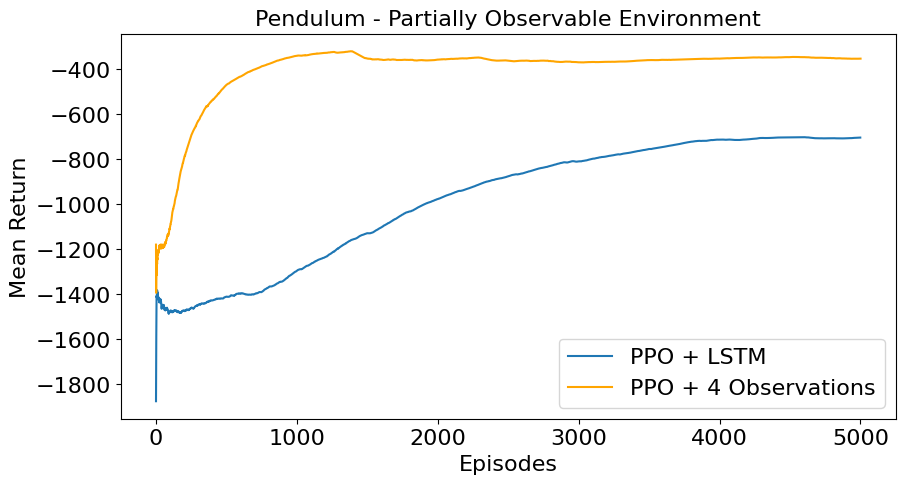
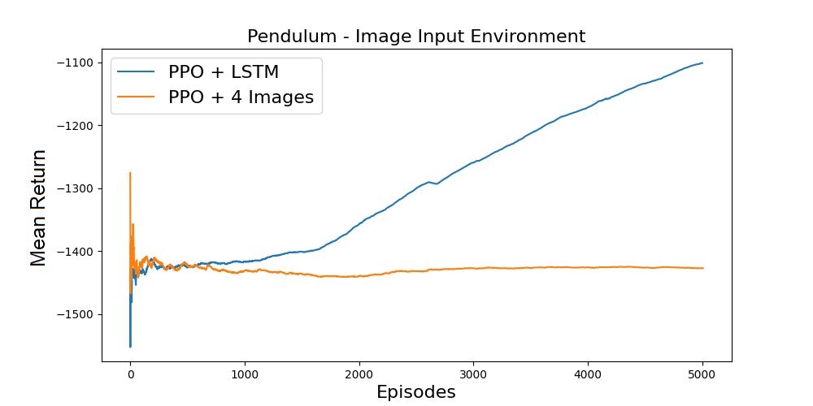

# LSTM vs FrameStacking

## Full Name of the Paper
**A Comparative Study on the Performance of LSTM and Frame Stacking Methods in Time Series Data Processing Based on Environmental Complexity**

**환경 복잡도에 따른 시계열 데이터 처리 시 LSTM 과 프레임 스태킹 방법의 성능 비교**

## Overview
This repository contains the code and materials related to the research on comparing the performance of two different methods, **PPO with Frame Stacking** and **PPO with LSTM**, for processing time series data in environments of varying complexity. The study focuses on OpenAI Gym's Pendulum environment, introducing three levels of observation difficulty to evaluate the models' effectiveness.

## Get Started
To get started with this repository:
1. Clone this repository to your local machine:
    ```bash
    git clone https://github.com/LSTMvsFrameStacking.git
    ```
2. Install the required dependencies:
    ```bash
    pip install -r requirements.txt
    ```

## Introduction
Time series data processing is vital in reinforcement learning applications such as robotics control, autonomous driving, and game AI. This research compares two common methods for handling time series data:
- **Frame Stacking:** Accumulates previous state data to reflect temporal dependencies.
- **LSTM (Long Short-Term Memory):** A recurrent neural network (RNN) that learns temporal dependencies through its architecture.

The goal of this study is to evaluate which method performs better in environments of varying complexity, specifically within the OpenAI Gym's Pendulum environment. We modify the observation space of the Pendulum environment to simulate different complexities.

## Approach
### Model Definition
The study uses the **Proximal Policy Optimization (PPO)** algorithm with two variations:
1. **PPO + Frame Stacking:** Incorporates the last four observations (either vectors or images) at each step to create a new input.


2. **PPO + LSTM:** Adds an LSTM layer to process individual observations sequentially.



### Experimental Environments
The Pendulum environment was modified to create three types of observation settings:
1. **Fully Observable Environment:** Uses vector inputs including x, y coordinates, and angular velocity.
2. **Partially Observable Environment:** Uses vector inputs including only x, y coordinates.
3. **Image Input Environment:** Uses a 500x500 pixel RGB image as input.

## Results
The experiments show varying performances of the two methods across different environments:

### Graphical Results
Here are the performance graphs for the two models in each environment:

1. **Environment 1 (Fully Observable):**  
    

2. **Environment 2 (Partially Observable):**  
    

3. **Environment 3 (Image Input):**  
    

### Tabular Results
A summary of the test results for each environment is provided in the table below:

| Environment | PPO + Frame Stacking | PPO + LSTM         |
|-------------|----------------------|--------------------|
| Environment 1 | -175.92 ± 114.44   | -592.84 ± 79.61    |
| Environment 2 | -354.71 ± 234.05   | -584.38 ± 75.91    |
| Environment 3 | -1386.18 ± 224.57  | -727.30 ± 139.20   |


The experiments demonstrate clear differences in the performance of **PPO + Frame Stacking** and **PPO + LSTM** across environments of varying complexity. In Environment 1 (Fully Observable), **PPO + Frame Stacking** outperforms **PPO + LSTM**, showcasing its efficiency in simpler, fully observable settings. However, as the environment becomes more complex, the **PPO + LSTM** model increasingly proves to be the more suitable method.

In Environment 2 (Partially Observable), while **PPO + Frame Stacking** still performs well, **PPO + LSTM** starts to close the performance gap, indicating its adaptability to partially observable inputs.

In the most challenging Environment 3 (Image Input), **PPO + LSTM** significantly surpasses **PPO + Frame Stacking**, which fails to learn effectively. The results, as shown in the provided graphs and table, clearly illustrate that **PPO + LSTM** becomes more advantageous as the observation complexity increases.

## Conclusion
This study concludes that **PPO + LSTM demonstrates superior adaptability and suitability in environments with increasing observation complexity**. While **PPO + Frame Stacking** shows high performance in simpler environments, its effectiveness declines as complexity rises, particularly in image-based input settings. The **PPO + LSTM** model's ability to handle sequential data processing more effectively makes it the preferred choice in complex scenarios.

The introduction of image frame environments further distinguishes this research from previous studies, emphasizing the potential of **PPO + LSTM** models for broader real-world applications. These findings suggest that leveraging LSTM models, especially those integrated with CNN layers, can enhance control in virtual environments like Gymnasium and even in real-world scenarios involving camera-based observations.

## Limitations
This study has certain limitations, primarily focusing on a single environment, the Pendulum. To generalize the performance differences between the two models, future research should extend the experiments to more diverse environments. Additionally, while this study uniquely incorporates image frames into the environment, exploring other types of observations and inputs would further validate the conclusions drawn here.

Despite these limitations, the observed superiority of **PPO + LSTM** in more complex settings provides valuable insights into the model's potential for broader applicability, both in simulated environments and real-world control tasks.

---

For more details, please refer to the [paper](./LSTMvsFrameStacking_Final.pdf) and the accompanying [presentation](./LSTMvsFrameStacking_Presentation.pdf). Both files are written in Korean.

